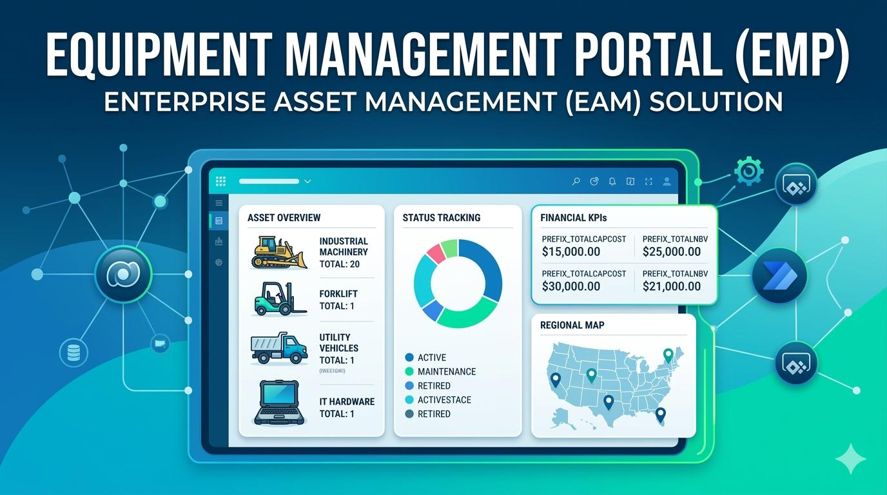

# Equipment Management Portal (EMP)
**An Enterprise Asset Management (EAM-lite) System for High-Stakes Operational Tracking.**

## 📑 Overview
The Equipment Management Portal is a model-driven solution designed to centralize equipment tracking, improve asset visibility, and standardize lifecycle management. It replaces fragmented spreadsheet-based tracking with a unified system of record, establishing a scalable foundation for regional operations and executive reporting.

## 📉 The Challenge
Historically, equipment data was managed across independent regional spreadsheets, leading to:
* **Data Fragmentation:** Lack of a single source of truth for asset status and location.
* **Administrative Latency:** High manual effort required to maintain and sync maintenance logs.
* **Visibility Gaps:** Difficulty in generating real-time financial KPIs (Total Capital Cost, Net Book Value) across large datasets.

## 🚀 The Solution: Model-Driven Architecture
EMP leverages **Microsoft Dataverse** and the **Power Platform** to create a robust operational environment:
* **Relational Data Modeling:** Structured entities for Equipment, Maintenance Logs, and Assignment History.
* **Enterprise Integration:** Architected to mirror SQL-based systems while providing a controlled "Operational Overlay" for local edits.
* **Financial Intelligence:** Custom-engineered logic to bypass standard 500-record platform limits for accurate, fleet-wide KPI calculations.
* **Regional Security:** Role-based access control (RBAC) ensuring specialists only manage assets within their assigned jurisdictions.

## 🛠️ Key Technical Features
* **Overlay Soft-Close Rule:** Preserves historical integrity by preventing hard deletes of integrated records.
* **Automated KPI Engine:** Real-time calculation of Total Net Book Value and Active Equipment counts.
* **Lifecycle State Machine:** Controlled transitions between Active, Maintenance, Out of Service, and Retired states.
